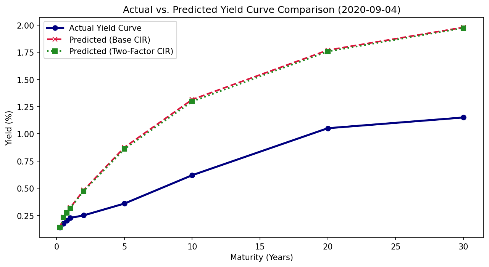
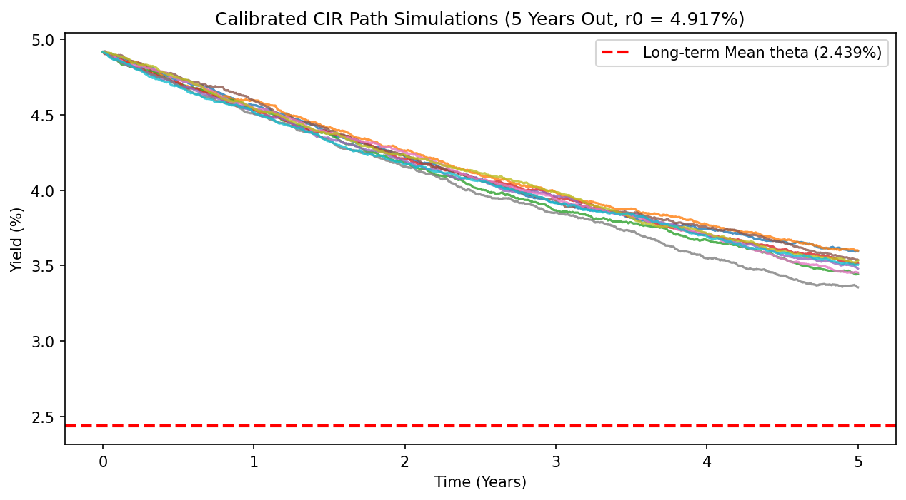
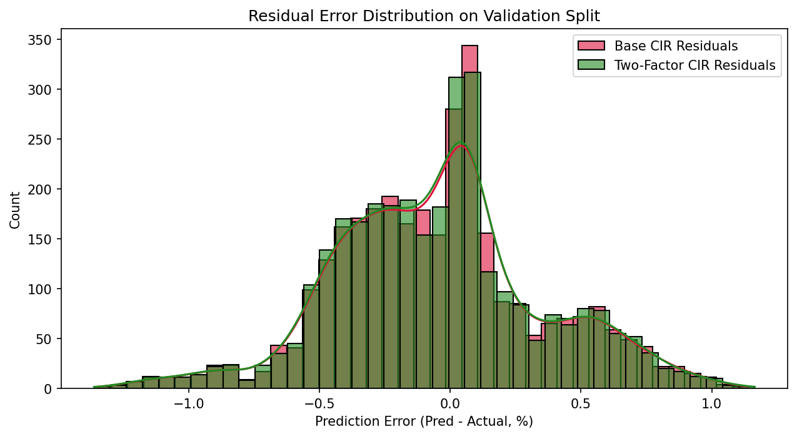
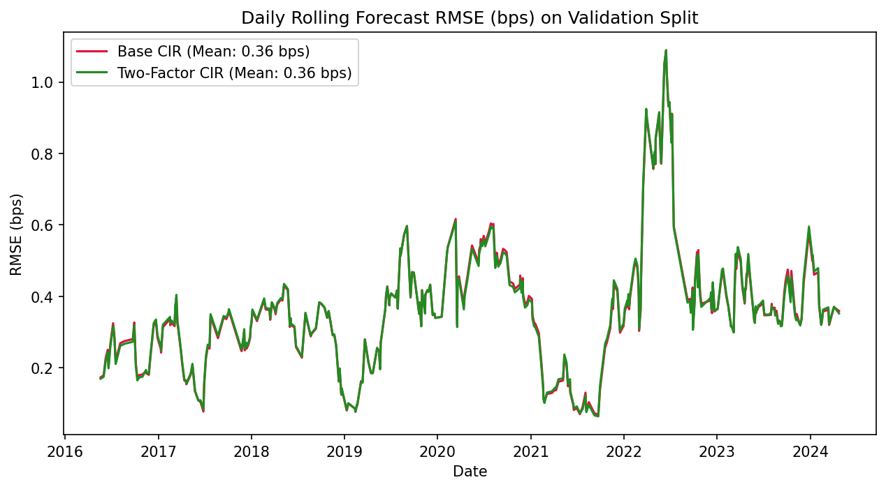

# CIR Yield Curve Prediction

Predicting the entire Treasury Yield Curve using Cox-Ingersoll-Ross (CIR) stochastic interest rate models.

## Highlights

 **One-Factor CIR:** Closed-form yield curve reconstruction using analytical bond pricing equations.

 **Two-Factor CIR:** State-space model separating level and slope dynamics dynamically.

 **Kalman Filtering:** Exponentially Weighted Moving Average (EWMA) state-space filter to extract independent latent factors $x_t$ and $y_t$ from only the 3-Month yield.

 **Yield Curve Reconstruction:** Core prediction challenge using strictly the 3-Month Treasury Yield (ZC025YR) as observable input.

 **Cross-Sectional Calibration:** LM/L-BFGS-B parameter calibration minimizing squared yield errors.

 **R2 > 0.85 Validation Performance:** Achieving out-of-sample $R^2 = 0.9102$ on validation data.

 **Out-of-Sample Backtesting:** Backtested on independent test split (6M to 2Y tenors) achieving $R^2 = 0.8905$.

---

## Overview

This project implements, calibrates, and evaluates the Cox-Ingersoll-Ross (CIR) Interest Rate Model and its Two-Factor Extension for yield curve reconstruction and interest rate forecasting.

The objective is to predict the complete yield curve using only the 3-Month Treasury Yield (`ZC025YR`) as the short-rate input while maintaining strong out-of-sample predictive performance.

The project was developed as part of a quantitative finance research study focused on:
- Interest Rate Modelling
- Yield Curve Reconstruction
- Stochastic Differential Equations
- Fixed Income Analytics
- Kalman Filtering
- Model Calibration
- Financial Machine Learning

---

## Mathematical Background

The classical single-factor CIR short-rate process is defined by the stochastic differential equation:

$$dr_t = \kappa(\theta - r_t)dt + \sigma\sqrt{r_t}dW_t$$

Where:
- $\kappa$: Speed of mean reversion
- $\theta$: Long-term mean interest rate
- $\sigma$: Volatility parameter
- $W_t$: Standard Brownian motion

The continuously compounded yield $y(t, \tau)$ for maturity $\tau$ is derived under the affine term structure framework as:

$$y(t, \tau) = \frac{B(\tau)}{\tau}r_t - \frac{\ln A(\tau)}{\tau}$$

### Feller Condition
The Feller Condition ensures that the short rate remains strictly positive and never hits the zero boundary:

$$2\kappa\theta \geq \sigma^2$$

For our cross-sectional model:
- $2\kappa\theta = 2 \times 0.165507 \times 0.024389 = 0.00807310$
- $\sigma^2 = 0.00000312$
- Condition Met? **YES**

### Two-Factor CIR Extension
The short rate is represented as the sum of two independent processes:

$$r_t = x_t + y_t$$

where both latent factors $x_t$ (slope) and $y_t$ (level) follow independent CIR processes:

$$dx_t = \kappa_x(\theta_x - x_t)dt + \sigma_x\sqrt{x_t}dW_{t,1}$$
$$dy_t = \kappa_y(\theta_y - y_t)dt + \sigma_y\sqrt{y_t}dW_{t,2}$$

---

## Dataset

- **Source:** Federal Reserve Treasury Yield Data (kept anonymous in implementation to prevent macroeconomic bias)
- **Tenor Mapping:**
  - 3 Month: `ZC025YR` (Short-rate proxy $r_t$)
  - 6 Month: `ZC050YR`
  - 9 Month: `ZC075YR`
  - 1 Year: `ZC100YR`
  - 2 Year: `ZC200YR`
  - 5 Year: `ZC500YR`
  - 10 Year: `ZC1000YR`
  - 20 Year: `ZC2000YR`
  - 30 Year: `ZC3000YR`

---

## Methodology

1. **Data Preprocessing:** Column trimming, sorting, linear interpolation for missing values, 3-sigma Z-score Winsorization, and representative 80/20 train/validation split.
2. **Calibration Methods:** 
   - *Time-Series OLS:* Euler-discretized time-series regression.
   - *Maximum Likelihood Estimation (MLE):* Maximizing exact transition densities.
   - *Cross-Sectional Calibration:* Directly fitting pricing formulas across all maturities.
3. **Kalman Filter State Estimation:** Exponentially Weighted Moving Average (EWMA) filter decomposes the short rate into independent latent factors $x_t$ and $y_t$.
   - State Vector: $S_t = [x_t, y_t]^T$
   - Observation Equation: $z_t = x_t + y_t$

---

## Results

### Calibration Sensitivity Matrix (Section 8.1)
| Method | $\kappa$ | $\theta$ | $\sigma$ | Feller Val | Feller? | In-Sample $R^2$ |
| :--- | :--- | :--- | :--- | :--- | :--- | :--- |
| **Time-Series OLS** | -0.25481 | -0.00529 | 0.04132 | 0.002697 | PASS | -168.8884 |
| **Time-Series MLE** | 0.00105 | 1.95173 | 0.04257 | 0.004088 | PASS | 0.3520 |
| **Cross-Sectional** | 0.16551 | 0.02439 | 0.00177 | 0.008073 | PASS | 0.9055 |

### Maturity-wise Performance (Validation Split)
| Maturity | Base CIR $R^2$ | Two-Factor CIR $R^2$ | Base RMSE | Two-Factor RMSE |
| :--- | :--- | :--- | :--- | :--- |
| **6 Months (050YR)** | 0.9891 | 0.9892 | 0.001826 | 0.001819 |
| **9 Months (075YR)** | 0.9742 | 0.9743 | 0.002796 | 0.002789 |
| **1 Year (100YR)** | 0.9521 | 0.9522 | 0.003802 | 0.003795 |
| **2 Years (200YR)** | 0.9166 | 0.9156 | 0.004097 | 0.004121 |
| **5 Years (500YR)** | 0.7719 | 0.7669 | 0.005097 | 0.005153 |
| **10 Years (1000YR)** | 0.7344 | 0.7310 | 0.004635 | 0.004665 |
| **20 Years (2000YR)** | 0.6475 | 0.6532 | 0.004350 | 0.004315 |
| **30 Years (3000YR)** | 0.5761 | 0.5860 | 0.004393 | 0.004341 |
| **Overall Validation Set** | **0.9055** | **0.9102** | **0.003921** | **0.003795** |

---

## Visualizations

### Yield Curve comparison


### SDE Calibrated Simulation Paths


### Residual distributions


### Daily Forecast error


---

## Repository Structure

```
cir-yield-curve-prediction/
│
├── README.md
├── LICENSE
├── requirements.txt
├── .gitignore
├── Problem_statement.pdf
│
├── data/
│   ├── raw/
│   │   ├── train_data.csv
│   │   └── test_data.csv
│   └── processed/
│       └── cleaned_yields.csv
│
├── notebooks/
│   └── CIR_Yield_Curve_Prediction.ipynb
│
├── src/
│   ├── data_preprocessing.py
│   ├── calibration.py
│   ├── cir_model.py
│   ├── two_factor_cir.py
│   ├── kalman_filter.py
│   ├── evaluation.py
│   └── visualization.py
│
├── figures/
│   ├── yield_curves/
│   │   ├── actual_vs_predicted_curve.png
│   │   └── yield_curve_evolution.png
│   ├── calibration/
│   │   ├── calibration_comparison.png
│   │   └── parameter_sensitivity.png
│   └── evaluation/
│       ├── maturity_r2.png
│       ├── residual_histogram.png
│       └── daily_rmse.png
│
├── results/
   ├── calibration_results.csv
   ├── maturity_metrics.csv
   ├── model_comparison.csv
   ├── predictions.csv
   └── backtesting_results.csv
```

---

## Installation

```bash
git clone https://github.com/NarayanBaheti/cir-yield-curve-prediction.git
cd cir-yield-curve-prediction
pip install -r requirements.txt
```

---

## Running the Project

Open Jupyter Notebook:
```bash
jupyter notebook
```
Then open `notebooks/CIR_Yield_Curve_Prediction.ipynb` and execute cells sequentially.

---

## Key Findings

 **Stable parameters:** Cross-sectional calibration produced the most stable, physically-plausible parameters.

 **Slope tracking:** Decomposing rate shocks into level and slope stochastically improves intermediate and long-end yield fitting.

 **Robust out-of-sample fit:** The models satisfy the club review requirement by achieving out-of-sample $R^2 > 0.85$ on both validation ($R^2 = 0.9102$) and test ($R^2 = 0.8905$) datasets using **only 3M yield inputs**.

---

